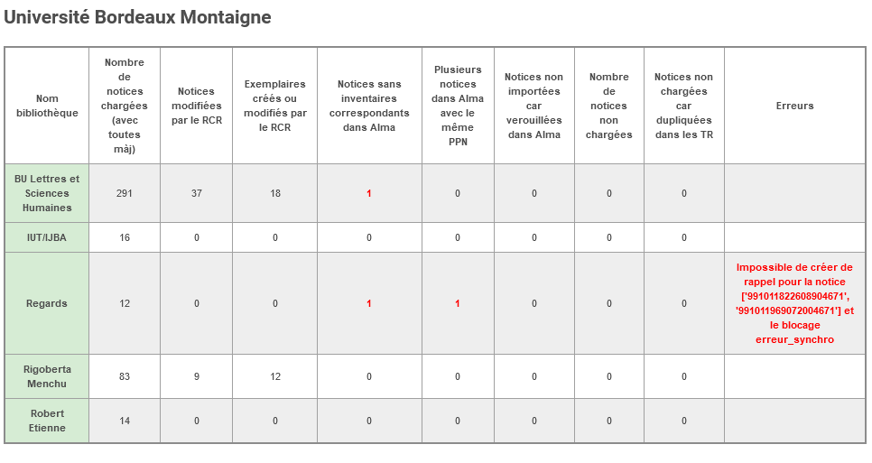

# Programme de suivi quotidien des imports des notices SUDOC dans Alma 
Ce programme permet d'analyser aux moyens des API Alma et Sudoc les imports quotidiens des notices SUDOC dans Alma. Il permet nottament de :
- Rattacher chaque notice au RCR responsable de sa descente
- Identifier les notices en anomalies :
    - Les doublons de notices 
    - Les notices chargées sans exemplaires dans Alma
    - Les notices non chargées
- Construire un rapport sous forme de tableau, ventilé par institution, périmètre puis bibliothèque.

Il fournit ainsi aux coordinateurs du signalement un rapport par mail quotidien permettant :
 - de suivre l’activité de son établissement ou de sa bibliothèque
 - de résoudre immédiatement les anomalies de synchronisations
 - de contrôler la qualité des notices produites par son RCR

Les anomalies sont signalées sous forme de [rappels](https://knowledge.exlibrisgroup.com/Alma/Product_Documentation/Alma_Online_Help_(Francais)/080Gestion_des_m%C3%A9tadonn%C3%A9es/030Travail_avec_des_notices_bibliographiques/090Travailler_avec_des_rappels) et les notices à contrôler sont ajoutées dans des jeux de résultats.

[Lien vers la documentation fonctionnelle](https://rebub.u-bordeaux.fr/index.php/alma/procedures/gestion-des-ressources/qualite-des-donnees/outil-de-suivi-des-chargements-quotidiens/)

Le programme analyse le rapport de chargement de l'import SUDOC du jour pour obtenir la liste des notices chargées. Il va ensuite interroger le SUDOC pour identifier quels RCR de l'ILn sont responsables de la descente de chaque notice.

## Nettoyage des jeux de résulats (AlmaNettoieSet())
Le programme créé de nombreux jeux de résultats  :
 1. En zone réseau, les jeux permettent de récupérer les anomalies de type IMPORTED_RECORDS_NO_MATCH','NOT_ADDED_LOCKED','NOT_ADDED_DUPLICATED'. Le nom de ces jeux est préfixé par la chaîne de caractère définie dans le paramètre "PREFIXE_SETS_ZONE_RESEAU"
 2. Dans les institutions  pour partager aux bibliothèques la liste des notices chargées pour lesquelles la bibliothèque est responsable de la descente.
 Le nom de ces jeux est préfixé par la chaîne de caractère définie dans le paramètre "PREFIXE_SETS_INSTITUTION"
 
Pour ne pas surcharger Alma le programme nettoie les jeux créés depuis une période définie dans le paramètre DELAI_CONSERVATION_SETS_INSTITUTION. Pour ce nettoyage, le programme utilise les API Alma [get sets](https://developers.exlibrisgroup.com/alma/apis/docs/conf/R0VUIC9hbG1hd3MvdjEvY29uZi9zZXRz/) et [delete set](https://developers.exlibrisgroup.com/alma/apis/docs/conf/REVMRVRFIC9hbG1hd3MvdjEvY29uZi9zZXRzL3tzZXRfaWR9/).

## Récupération du rapport de traitement (Alma_api_imports.AlmaJob_Instance_Id())
Le programme passe par le rapport de traitement du job d'import  pour obtenir la liste des notices chargées et les listes des notices en anomalies. Pour ce faire, il va d'abord obtenir l'identifiant de l'instance du job d'import (JOB_ID) qui s'est exuctée le jour même (date_du_jour) via l'API [retrieve job instances](https://developers.exlibrisgroup.com/alma/apis/docs/conf/R0VUIC9hbG1hd3MvdjEvY29uZi9qb2JzL3tqb2JfaWR9L2luc3RhbmNlcw==/).
Une fois l'identifiant du traitement obtenu, le programme récupère le rapport de traitement (job_import.get_job_infos()) via l'API [Retrieve Job Instance Details](https://developers.exlibrisgroup.com/alma/apis/docs/conf/R0VUIC9hbG1hd3MvdjEvY29uZi9qb2JzL3tqb2JfaWR9L2luc3RhbmNlcy97aW5zdGFuY2VfaWR9/)

## Récupération de la liste des notices chargées
Le script récupère la liste des notices chargées ou en anomalie depuis le rapport de traitement.
Voici les différents cas (population) identifiés via le rapport :
-  SINGLE_MATCHES : notices fusionnées sans doublons
-  MULTI_MATCHES : notices non importées coorrespondances multiples dans Alma
-  IMPORTED_RECORDS_NO_MATCH : notices ajoutées sans correspondances
-  NOT_ADDED_LOCKED : notices non ajoutées car verrouillées par un autre utilisateur
-  NOT_ADDED_DUPLICATED : notices non ajoutées car dupliquées dans le fichier d'import

La méthode de récupération de la liste des notices va différer en fonction du type de cas : 
-  Pour les cas SINGLE_MATCHES (AlmaMatchFromImport())et MULTI_MATCHES (AlmaMultimatchFromImport()), on utilise l' API [Retrieve Job Matching Details](https://developers.exlibrisgroup.com/alma/apis/docs/conf/R0VUIC9hbG1hd3MvdjEvY29uZi9qb2JzL3tqb2JfaWR9L2luc3RhbmNlcy97aW5zdGFuY2VfaWR9L21hdGNoZXM=/)
- Pour les autres cas (AlmaSetFromImport()) on demande à Alma de créer un jeu  exemplarisé pour le cas passé en paramètre (population). Pour ce faire on utilise l'API [Create a Set](https://developers.exlibrisgroup.com/alma/apis/docs/conf/UE9TVCAvYWxtYXdzL3YxL2NvbmYvc2V0cw==/). On utilise ensuite l'API  [Retrieve a Set](https://developers.exlibrisgroup.com/alma/apis/docs/conf/R0VUIC9hbG1hd3MvdjEvY29uZi9zZXRzL3tzZXRfaWR9/) pour savoir si le job est terminé (job_is_comleted()) et récupérer le nombre de résulats dans le jeu (get_nombre_de_membres). On appelle ensuite l'API [Retrieve Set Members](https://developers.exlibrisgroup.com/alma/apis/docs/conf/R0VUIC9hbG1hd3MvdjEvY29uZi9qb2JzL3tqb2JfaWR9L2luc3RhbmNlcy97aW5zdGFuY2VfaWR9L21hdGNoZXM=/) autant de fois que nécessaire[^1] pour obtenir la liste des notices.

Pour chaque cas, la liste des notices est enrichie des informations bibliographiques et des localisations dans Alma via l'API [Retrieve Bib](https://developers.exlibrisgroup.com/alma/apis/docs/bibs/R0VUIC9hbG1hd3MvdjEvYmlicy97bW1zX2lkfQ==/) (AlmaRecord.AlmaRecord()). 

Toutes les notices sont ensuite ajoutées à une liste unique (liste_notices_chargees)

##  Récupération des informations de localisation dans le SUDOC
Le script parcourt la liste des notices chargées. Pour chaque lot de 100 notices, il interroge le web service where de l'Abes (Sudoc_test_localisation.Sudoc_Qui_Est_Loc()).

## Rattachement des notices à une bibliothèque responsable de sa descente
Le programme exploite ensuite les résultats de l'API pour déterminer quel RCR est responsable de la descente de la notice. 
### Modification de la notice pour l'un de nos rcr 
Si un RCR de l'ILN a modifié la notice la veille du jour de l'exécution du script alors ce RCR est considéré comme responsable de la decente de la notice à cause de la modification de cette dernière. La notice et donc rattaché à ce dernier avec le statut (type_modif) **modif_notice**.
### Analyse des  localistations SUDOC
Pour chaque localisation dans le SUDOC, si l'exemplaire a été créé ou modifié la veille du jour de l'exécution du script, alors la notice est rattachée au RCR avec le statut **modif_exemplaire**. Sinon la notice est rattachée au RCR avec le statut **toute_mise_a_jour**.

## Construction et envoie du rapport de traitement
Le programme va créer des Rappels sous chaque notice en anomalie et pour chaque RCR concerné (i.e responsable de la descente de la notice ou ayant une localisation manquante dans ALMA). 
Il crée des jeux de résultats sous chaque instance ALMA pour chaque RCR. Chaque jeu liste les notices modifiées ou sous lesquelles la bibliothèque s'est localisée la veille dans le SUDOC. Il créé enfin le rapport de traitement qu'il envoie par mails aux coordinateurs.

[^1]: L'api ne remonte que 100 résultats à la fois. On utilise le paramètre offset pour décaler la liste des résultats à chaque appel. 
